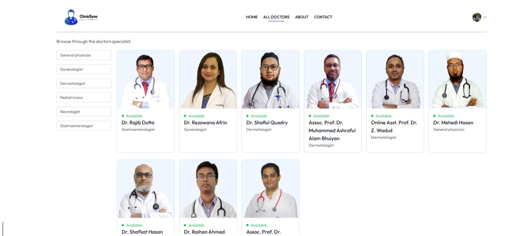

# Live Preview

You can try out ClinicSync live here:

[Live Demo](https://clinic-sync-q82n.vercel.app/)

---

# ClinicSync

ClinicSync is an end-to-end Doctor's Appointment Management System designed to streamline the process of booking, managing, and tracking medical appointments for clinics, doctors, and patients. The system provides dedicated interfaces for administrators, doctors, and patients, ensuring a seamless experience for all users.


## Table of Contents

- [Features](#features)
- [Project Structure](#project-structure)
- [Tech Stack](#tech-stack)
- [Setup Instructions](#setup-instructions)
- [Folder Overview](#folder-overview)
- [Contributing](#contributing)
- [License](#license)

---

## Features

- **Admin Panel**: Manage doctors, view all appointments, monitor system statistics, and handle appointment cancellations.
- **Doctor Dashboard**: View and manage appointments, update profile, and track patient interactions.
- **Patient Portal**: Register/login, browse doctors by specialty, book appointments, view appointment history, and manage profile.
- **Authentication**: Secure login for admins, doctors, and patients.
- **Cloud Storage**: Doctor profile images and documents are stored securely using Cloudinary.
- **Responsive UI**: Built with React and Tailwind CSS for a modern, mobile-friendly experience.
- **RESTful API**: Node.js/Express backend with MongoDB for data storage.

---

## Project Structure

```
ClinicSync/
│
├── admin/         # Admin dashboard (React + Vite)
├── clientside/    # Patient-facing frontend (React + Vite)
└── backend/       # Node.js/Express backend API

```

---

## Tech Stack

- **Frontend**: React, Vite, Tailwind CSS, Axios, React Router
- **Backend**: Node.js, Express, MongoDB, Mongoose, JWT, Cloudinary, Multer
- **Other**: ESLint, PostCSS, Vercel (deployment)

---

## Setup Instructions

### Prerequisites

- Node.js (v18+ recommended)
- npm or yarn
- MongoDB instance (local or cloud)
- Cloudinary account (for image uploads)
- Vercel (optional, for deployment)

### 1. Clone the Repository

```sh
git clone https://github.com/istiyaq13/ClinicSync.git
cd ClinicSync
```

### 2. Backend Setup

```sh
cd backend
npm install
# Create a .env file with MongoDB, JWT, Cloudinary credentials
npm run server
```

### 3. Admin Frontend Setup

```sh
cd ../admin
npm install
npm run dev
```

### 4. Client Frontend Setup

```sh
cd ../clientside
npm install
npm run dev
```

### 5. Environment Variables

Each part (`backend`, `admin`, `clientside`) requires a `.env` file. Example for backend:

```
MONGODB_URL=your_mongodb_connection_string
JWT_SECRET=your_jwt_secret
ADMIN_EMAIL=admin@example.com
ADMIN_PASSWORD=yourpassword
CLOUDINARY_CLOUD_NAME=your_cloud_name
CLOUDINARY_API_KEY=your_api_key
CLOUDINARY_API_SECRET=your_api_secret
```

---

## Folder Overview

- **admin/**: Admin dashboard React app (pages: Dashboard, AddDoctor, DoctorsList, AllAppointments, etc.)
- **clientside/**: Patient portal React app (pages: Home, Doctors, Appointment, MyProfile, etc.)
- **backend/**: Express API, MongoDB models, authentication, controllers for admin, doctor, and user, file uploads, and more.

---

## Contributing

Pull requests are welcome! For major changes, please open an issue first to discuss what you would like to change.

---

## License

This project is licensed under the MIT License.

---

